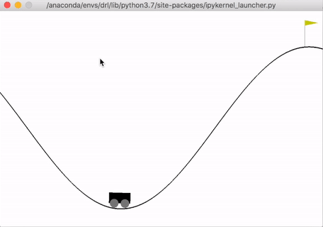
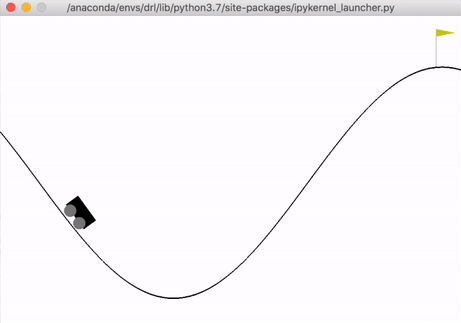
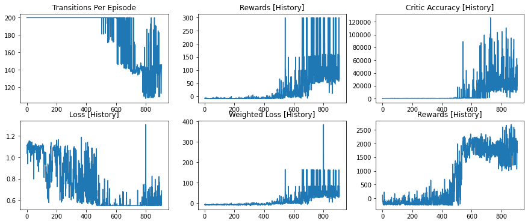

# Deep Reinforcement Learning: Actor Critic for Mountain Car

The objective of this Python program is to teach the car to go to the end point on the mountain, through deep reinforcement learning. The unlearned behavior is shown below (10 episodes):



<br/>
<br/>

After training and self-learning based on the reward system, and almost 1000 episodes later, the behavior of the car is transformed into the below (10 episodes):



The car learns, through rewards, to speed up back and forth, until it reaches the end point on the mountain at the right side of the screen. Below is the notebook, that calls the python files in the same repo.

<br/>
<br/>


```python
import gym
from Agent import Agent

import warnings
warnings.filterwarnings('ignore')
import os
import tensorflow as tf
import matplotlib

%load_ext autoreload
%autoreload 2
```

    The autoreload extension is already loaded. To reload it, use:
      %reload_ext autoreload


```python
env_name = 'MountainCar-v0'
env = gym.make(env_name)

agent = Agent(env, env_name, nn_dims=[64, 64], cr_dims=[64])
agent.train(episodes = 12000)

env.close()
```


    
    
    New Episode 905 Length 134
    *******************************
    **** Batch T(start):T(end) 0 8 out of 134
    **** Batch T(start):T(end) 8 16 out of 134
    **** Batch T(start):T(end) 16 24 out of 134
    **** Batch T(start):T(end) 24 32 out of 134
    **** Batch T(start):T(end) 32 40 out of 134
    **** Batch T(start):T(end) 40 48 out of 134
    **** Batch T(start):T(end) 48 56 out of 134
    **** Batch T(start):T(end) 56 64 out of 134
    **** Batch T(start):T(end) 64 72 out of 134
    **** Batch T(start):T(end) 72 80 out of 134
    O(st) [array([-0.31995765, -0.03293187])]
    O(st+1) [array([-0.35532359, -0.03536593])]
    V(st) [472.44818 475.17386 478.08228 481.1543 ]
    V(st+1) [475.17386 478.08228 481.1543  484.36856]
    Actions [[1. 0. 0.]
     [1. 0. 0.]
     [1. 0. 0.]
     [1. 0. 0.]
     [1. 0. 0.]]
    Logits [[1.0000000e+00 5.5558951e-14 1.9387353e-17]
     [1.0000000e+00 9.8763628e-18 2.3237337e-20]
     [1.0000000e+00 4.5862496e-17 1.7249297e-20]
     [1.0000000e+00 2.2468886e-17 1.3275587e-20]
     [1.0000000e+00 6.3078047e-18 7.2310400e-21]]
    Rewards [11.507493 13.118859 14.626522 15.979077 17.129717]
    A(st) [ 9.481431 11.246453 12.88702  14.349652 15.586076]
    NLs [0.55144465 0.55144465 0.55144465 0.55144465 0.55144465]
    WNLs [5.2284846 6.2017965 7.106478  7.913039  8.594858 ]
    Loss 7.92243
    Critic::Training Values [[-0.31995765 -0.03293187]] [481.92958263 486.42025166 490.96921581 495.5039524 ] 
     
    
    **** Batch T(start):T(end) 80 88 out of 134
    **** Batch T(start):T(end) 88 96 out of 134
    **** Batch T(start):T(end) 96 104 out of 134
    **** Batch T(start):T(end) 104 112 out of 134
    **** Batch T(start):T(end) 112 120 out of 134
    **** Batch T(start):T(end) 120 128 out of 134
    **** Batch T(start):T(end) 128 134 out of 134
    
    
    New Episode 906 Length 146
    *******************************
    **** Batch T(start):T(end) 0 8 out of 146
    **** Batch T(start):T(end) 8 16 out of 146
    **** Batch T(start):T(end) 16 24 out of 146
    **** Batch T(start):T(end) 24 32 out of 146
    **** Batch T(start):T(end) 32 40 out of 146
    **** Batch T(start):T(end) 40 48 out of 146
    **** Batch T(start):T(end) 48 56 out of 146
    **** Batch T(start):T(end) 56 64 out of 146
    **** Batch T(start):T(end) 64 72 out of 146
    **** Batch T(start):T(end) 72 80 out of 146
    O(st) [array([0.12604042, 0.00954765])]
    O(st+1) [array([0.13226466, 0.00622425])]
    V(st) [439.40338 438.79764 438.45544 438.37576]
    V(st+1) [438.79764 438.45544 438.37576 438.55832]
    Actions [[1. 0. 0.]
     [1. 0. 0.]
     [1. 0. 0.]
     [1. 0. 0.]
     [1. 0. 0.]]
    Logits [[1.0000000e+00 3.1278552e-13 7.5472482e-15]
     [1.0000000e+00 8.9177121e-12 2.0446961e-13]
     [1.0000000e+00 2.7311822e-14 1.8358467e-15]
     [1.0000000e+00 2.5873593e-15 4.3047666e-18]
     [1.0000000e+00 1.8699011e-14 4.2902666e-14]]
    Rewards [-0.61258745 -0.9148244  -0.9985656  -0.8647921  -0.51194304]
    A(st) [-5.606301  -5.64157   -5.4620056 -5.067826  -4.4565535]
    NLs [0.55144465 0.55144465 0.55144465 0.55144465 0.55144465]
    WNLs [-3.0915647 -3.1110137 -3.011994  -2.7946255 -2.4575427]
    Loss -2.3220053
    Critic::Training Values [[0.12604042 0.00954765]] [433.79710432 433.15609568 432.99340945 433.30794379] 
     
    
    **** Batch T(start):T(end) 80 88 out of 146
    **** Batch T(start):T(end) 88 96 out of 146
    **** Batch T(start):T(end) 96 104 out of 146
    **** Batch T(start):T(end) 104 112 out of 146
    **** Batch T(start):T(end) 112 120 out of 146
    **** Batch T(start):T(end) 120 128 out of 146
    **** Batch T(start):T(end) 128 136 out of 146
    **** Batch T(start):T(end) 136 144 out of 146
    **** Batch T(start):T(end) 144 146 out of 146
    
    
    New Episode 907 Length 142
    *******************************
    **** Batch T(start):T(end) 0 8 out of 142
    **** Batch T(start):T(end) 8 16 out of 142
    **** Batch T(start):T(end) 16 24 out of 142
    **** Batch T(start):T(end) 24 32 out of 142
    **** Batch T(start):T(end) 32 40 out of 142
    **** Batch T(start):T(end) 40 48 out of 142
    **** Batch T(start):T(end) 48 56 out of 142
    **** Batch T(start):T(end) 56 64 out of 142
    **** Batch T(start):T(end) 64 72 out of 142
    **** Batch T(start):T(end) 72 80 out of 142
    O(st) [array([-0.06729122, -0.00427551])]
    O(st+1) [array([-0.07501596, -0.00772474])]
    V(st) [454.84863 455.34772 456.12033 457.16525]
    V(st+1) [455.34772 456.12033 457.16525 458.48035]
    Actions [[1. 0. 0.]
     [1. 0. 0.]
     [1. 0. 0.]
     [1. 0. 0.]
     [1. 0. 0.]]
    Logits [[1.0000000e+00 9.9397725e-13 2.8822914e-16]
     [1.0000000e+00 8.3322724e-15 2.7944546e-16]
     [1.0000000e+00 4.7651930e-12 1.0861235e-15]
     [1.0000000e+00 8.3744586e-16 1.8715385e-18]
     [1.0000000e+00 5.5548881e-14 3.1916685e-18]]
    Rewards [-0.4032839   0.24583517  1.1253598   2.2275102   3.5404687 ]
    A(st) [-4.4576664  -3.5427392  -2.4013736  -1.0422041   0.52212757]
    NLs [0.55144465 0.55144465 0.55144465 0.55144465 0.55144465]
    WNLs [-2.4581563  -1.9536246  -1.3242246  -0.5747179   0.28792447]
    Loss 0.121747985
    Critic::Training Values [[-0.06729122 -0.00427551]] [450.39098642 451.8050231  453.71895999 456.12305347] 
     
    
    **** Batch T(start):T(end) 80 88 out of 142
    **** Batch T(start):T(end) 88 96 out of 142
    **** Batch T(start):T(end) 96 104 out of 142
    **** Batch T(start):T(end) 104 112 out of 142
    **** Batch T(start):T(end) 112 120 out of 142
    **** Batch T(start):T(end) 120 128 out of 142
    **** Batch T(start):T(end) 128 136 out of 142
    **** Batch T(start):T(end) 136 142 out of 142
    Model Fully Trained





```python
agent.simulate()
```

    0 147 2019.3903526178015 300
    1 149 2039.0914508414965 300
    2 147 2117.0591901088255 300
    3 146 1718.6084491347249 300
    4 149 2152.9145857386484 300
    5 153 1479.91711471191 300
    6 200 357.9660315119432 17.17417872984203
    7 146 1795.2008703742347 300
    8 148 1936.5998313544367 300
    9 150 2133.4930939985443 300

